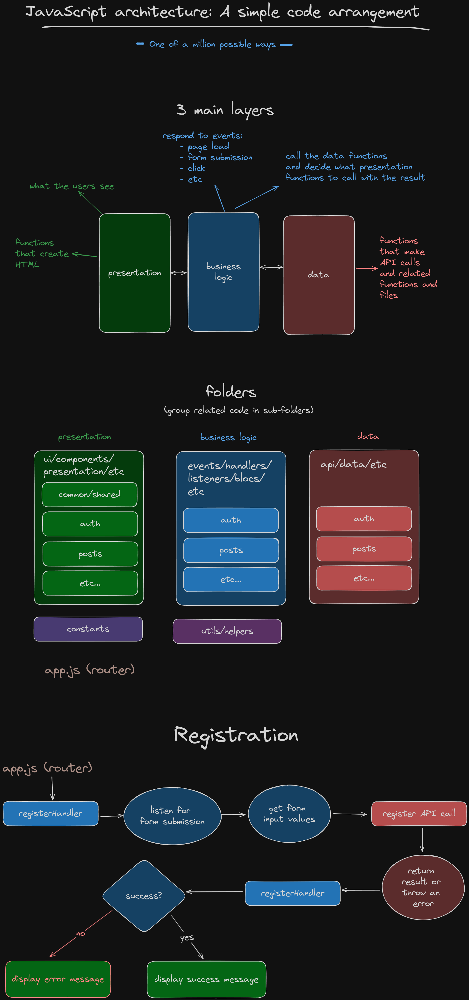

# Code arrangement

The videos and code in this repo cover one potential way to arrange your JavaScript code while building a registration form.

The code and videos are split across four branches.

1. Code arrangement (this branch)
2. [Register form submit handler](https://github.com/cnnrbrn/js2-code-arrangement/tree/2-register-form-submit-handler)
3. [Register API call](https://github.com/cnnrbrn/js2-code-arrangement/tree/3-register-api-call)
4. [Displaying messages](https://github.com/cnnrbrn/js2-code-arrangement/tree/4-JS2-CA-display-register-call-results)

[Video](https://www.loom.com/share/10e4d89e5156472d9240916d28f6b1dd?sid=82c49729-927a-4afb-aed1-748e16ef8c66)

